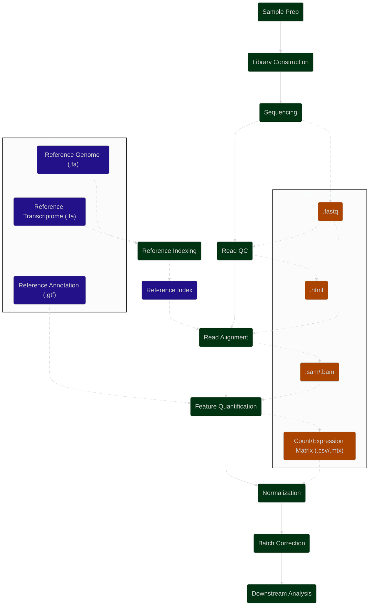

```mermaid
%%{init: {'theme':'dark','themeVariables': { 'fontSize': '20px', 'fontFamily': 'Arial'}}}%%
flowchart TB
    classDef task fill:#003311;
    classDef output fill:#AA4400;
    classDef input fill:#221188;
	classDef group	fill:#FbFbFb,stroke:#000000,font-color:#000000,stroke-width:1px;

	sample(Sample Prep):::task
	library(Library Construction):::task
	sequencing(Sequencing):::task
	readQC(Read QC):::task
	alignment(Read Alignment):::task
	quant(Feature Quantification):::task
	norm(Normalization):::task
	batch(Batch Correction):::task
	analysis(Downstream Analysis):::task
	indexing(Reference Indexing):::task
	inputGroup:::group
	outputGroup:::group

	refGenome("Reference Genome (.fa)"):::input
	refTxome("Reference Transcriptome (.fa)"):::input
	refAnnotation("Reference Annotation (.gtf)"):::input
	refIdx("Reference Index"):::input

	fastq(.fastq):::output
	fastqc(.html):::output
	bam(.sam/.bam):::output
	matrix("Count/Expression Matrix (.csv/.mtx)"):::output

	subgraph outputGroup[Output files]
		fastq
		fastqc
		bam
		matrix
	end


	subgraph inputGroup[Input files]
		refGenome
		refTxome
		refAnnotation
		refGenome~~~refTxome
		refTxome~~~~refAnnotation
	end

	sample--->library
	library--->sequencing
	sequencing-..->fastq
	sequencing--->readQC
	readQC-.->fastqc

	refGenome-.->indexing
	indexing-.->refIdx
	refIdx-.->alignment
	fastq-.->alignment
	refTxome-.->indexing
	fastq-.->readQC
	readQC--->alignment
	refAnnotation-.->quant
	bam-.->quant
	alignment--->quant
	alignment-.->bam
	quant-.->matrix
	quant-->norm
	matrix-.->norm
	norm--->batch
	batch--->analysis


```

